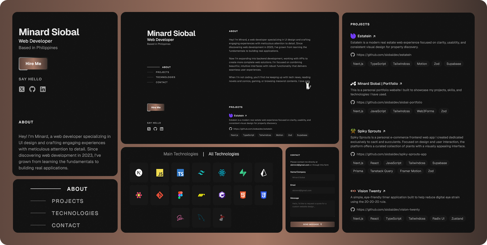

✨ Hey there!

I'm Minard Siobal, a web developer creating artistic yet functional digital experiences with a focus on thoughtful design and intuitive interactions. I enjoy crafting user-friendly interfaces that are both visually appealing and engaging.

I build web applications using Next.js, React, TypeScript, Node.js, Prisma and PostgreSQL(Supabase) — bringing interfaces to life with motion and subtle animations using libraries like Motion (formerly Framer Motion).

---

### Technologies

- Core Stack: Next.js, React, TypeScript, Node.js, PostgreSQL(Supabase), Tailwind CSS, Motion, TanStack (React) Query
- Tools & Design: Git, Figma
- Other Technologies: JavaScript, HTML, CSS, Prisma
- Previously Used: Sass, VB.NET, C#, MySQL, MS SQL

--- 

### Portfolio

Explore my projects ➜ [Portfolio](https://siobal-portfolio.vercel.app/)

