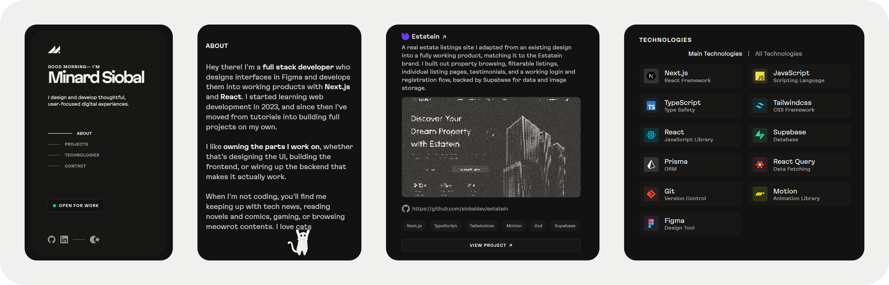

✨ Hey there!

I'm Minard. Most of what's here started as a Figma file before it became a repo, I like designing a thing properly before I start building it.

Currently building with Next.js, React, and TypeScript, with Prisma and Supabase handling the data side, and Motion for the small interactions that make an interface feel less static.

Self-taught since 2023. Still figuring out the parts I don't know yet, one project at a time.

---

### Technologies

- **Core Stack:** Next.js, React, TypeScript, PostgreSQL (Supabase), Tailwind CSS, Motion, TanStack Query, Prisma
- **Tools & Design:** Git, Figma
- **Other:** JavaScript, HTML, CSS, Sass
- **Previously Used:** VB.NET, C#, MySQL, MS SQL

---

### Portfolio

Explore my projects ➜ [Portfolio](https://siobal.is-a.dev/)

---

Let's talk: [sblmnrd@gmail.com](mailto:sblmnrd@gmail.com)
