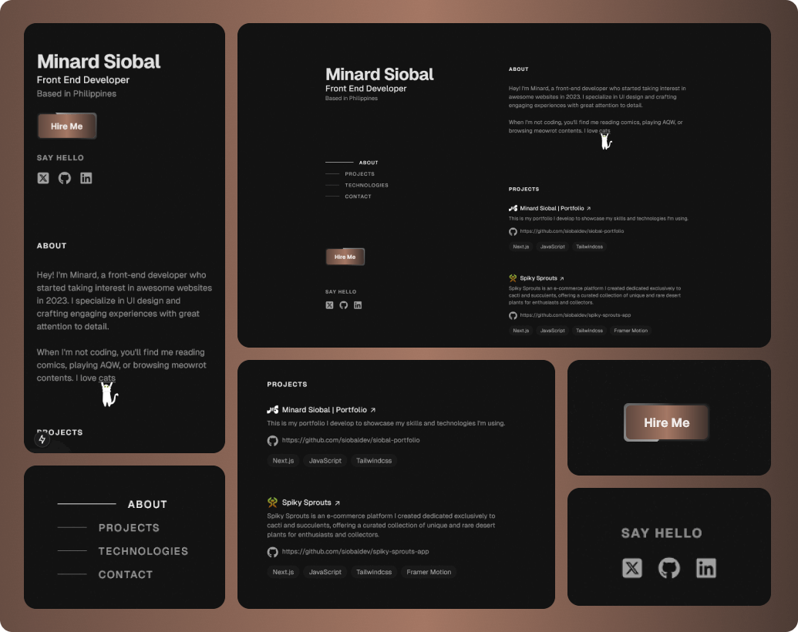

# ✨ Hi there! 👋

A passionate frontend developer from the Philippines aspiring to become a full-stack developer.   I enjoy crafting user-friendly, pixel-perfect, and visually appealing web experiences.

# 👨🏻‍💻 Portfolio

  🔗
  <a href="https://www.linkedin.com/in/minard-siobal-dev/">
     Portolfio Link
  </a>

 

# 🛠️ Technologies

# 📊 Github Stats

<!---
br0wnrecluse/br0wnrecluse is a ✨ special ✨ repository because its `README.md` (this file) appears on your GitHub profile.
You can click the Preview link to take a look at your changes.
--->
